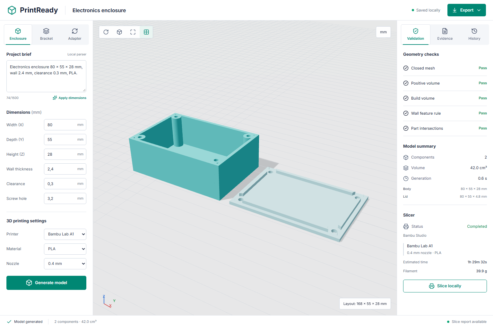
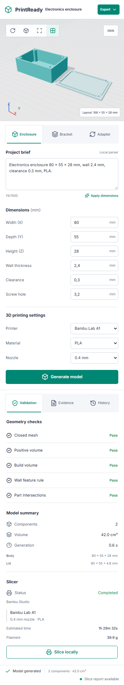

# PrintReady CAD Agent

[](https://github.com/santosgus3dtech/print-ready-cad-agent/actions/workflows/ci.yml)

A local, inspectable workflow from a measured design brief to parametric CAD, geometry checks and
print preparation. Codex, Claude and other MCP clients can retrieve design evidence, generate
parts and inspect the resulting files through typed tools.

The first release supports electronics enclosures, L-brackets and flanged adapters. It uses real
CadQuery/OpenCascade solids, real mesh validation and a Three.js viewer of the exported geometry.



## What works

- Three parameterized part families with validated dimensions and explicit fit clearance.
- STEP and STL manufacturing exports, geometry-only 3MF and a meter-correct GLB preview.
- Exact CAD validity, closed meshes, positive volumes, component envelopes and solid intersections.
- Per-component measurements, artifact SHA-256 hashes and local SQLite generation history.
- BM25 retrieval over versioned design notes, with inspectable source identifiers.
- English/Portuguese dimension extraction, including mm, cm and inch conversion.
- An MCP server with typed tools, resources and a design prompt.
- Local Bambu Studio slicing with resolved preset inheritance and includes. Exact preset matching
  is required; failures are recorded rather than treated as successful slicing.
- Responsive workbench with orbit, zoom, wireframe, grid, evidence and saved-design views.

## AI and validation boundaries

The MCP client supplies language-model reasoning. The browser's brief control is a **bounded local
dimension parser**, not an LLM and not unrestricted text-to-CAD. Generation uses trusted templates;
the server does not accept or execute user/model-supplied Python.

Retrieval currently searches a small illustrative note set. It is not a certified material database
or a multimodal embedding system. The included retrieval evaluation measures only this corpus.

The wall check examines template parameters against the selected nozzle, not every point of an
arbitrary mesh. Passing geometry checks does not certify strength, fit, slicer success or a physical
print. Support, bridging, material behavior and tolerances need slicer and physical review.

This public release has **no printer upload, heating, movement or print-start capability**.

## Stack

Python 3.11 · CadQuery/OpenCascade · trimesh · FastAPI · Pydantic · MCP Python SDK 2.x ·
rank-bm25 · SQLite · React · TypeScript · Three.js · Vite · pytest · Playwright · Ruff · GitHub Actions

## Run

Requirements: [uv](https://docs.astral.sh/uv/) and Node.js 24. Bambu Studio is optional.

```powershell
uv sync --locked --python 3.11 --extra dev
npm --prefix frontend ci
npm --prefix frontend run build
uv run printready-api
```

Open **http://127.0.0.1:8012** and generate a model. On Windows, `start.bat` performs setup and starts
the application. Generated files, logs, local profiles and the history database stay under ignored
`_data/`. Optional settings are documented in `.env.example`.

For frontend development, run the API and `npm --prefix frontend run dev` in separate terminals.
Vite serves http://127.0.0.1:5178 and proxies API calls to port 8012.

## MCP

Start the stdio server:

```powershell
uv run printready-mcp
```

Generic client configuration (replace the path with your checkout):

```json
{
  "mcpServers": {
    "printready": {
      "command": "uv",
      "args": ["--directory", "/absolute/path/print-ready-cad-agent", "run", "printready-mcp"]
    }
  }
}
```

Tools: `search_design_knowledge`, `plan_part`, `generate_part`, `inspect_job`, `list_design_jobs`,
`slice_design`. Resources: `printready://profiles` and `printready://knowledge`.

Example: ask your MCP client to create an 80 x 55 x 28 mm electronics enclosure with a 2.4 mm wall,
0.3 mm per-side lid clearance, 3.2 mm screws and an A1/PLA manufacturing profile. Inspect the cited
notes, geometry report and exact exported artifacts before slicing.

## Slicing

The first slicer adapter discovers local Bambu Studio and resolves its bundled BBL presets,
including inherited settings and G-code includes. It runs the CLI with explicit machine, process,
filament and plate selection. A successful result requires a sliced 3MF with embedded G-code.

The A1 defaults use the exact `Bambu Lab A1 0.4 nozzle`, `0.20mm Standard @BBL A1` and
`Generic PLA @BBL A1` presets. These are demonstration settings, not a claim about a user's loaded
filament. Review them before physical use. Preset availability depends on the installed slicer.

The K1C build envelope is supported for geometry validation; a separate exact-profile OrcaSlicer
adapter is a later milestone. A K1C request never silently uses an A1 slicer profile.

`model.3mf` contains geometry. Only a successful slicing stage produces `sliced.3mf` containing
G-code. Generated G-code is retained locally for review and is never sent to a printer.

## Checks

```powershell
uv run ruff check .
uv run ruff format --check .
uv run pytest
uv run python -m printready.evaluate
npm --prefix frontend run build
npx --prefix frontend playwright install chromium
npm --prefix frontend run test:e2e
```

Geometry tests re-import STEP, inspect STL and 3MF, check GLB units, reject invalid parameters and
exercise printer-envelope failures. API tests cover generation, downloads, origin checks and
profile separation. MCP tests verify the typed tool contract and a real stdio client session.
Playwright exercises generation, evidence, history, downloads, invalid inputs and viewport tools.
Canvas-pixel checks verify nonblank geometry, framing and movement at desktop and mobile sizes.
Test captures normally go to ignored `_data/qa/`. Set `PRINTREADY_CAPTURE_PORTFOLIO=1` when
deliberately regenerating the tracked portfolio screenshots.

The seven-query illustrative retrieval set currently scores Recall@3 1.0 and MRR@3 1.0; this is
a smoke evaluation, not evidence of real-world generalization. Real local A1 slicing was also
verified with Bambu Studio; it is not part of Linux CI and no physical print has been validated.

<details>
<summary>Mobile workbench</summary>



</details>

## Next milestones

1. Complete reproducible slicing and physical calibration cases for the supported templates.
2. Expand retrieval with licensed, curated CAD examples and measured fit results.
3. Add FreeCAD inspection and Blender mesh-editing adapters.
4. Add a K1C-specific OrcaSlicer adapter.
5. Build a separate private `print-ready-cad-agent-live` integration for personal models,
   PiSentinel telemetry and explicitly approved physical printing.

See [architecture](docs/ARCHITECTURE.md), [references](docs/REFERENCES.md) and
[security](SECURITY.md). The public and future private repositories share a reusable CAD core;
operational credentials and personal assets do not belong in the public repository.

## License

MIT. Dependency and external reference licenses remain their respective owners' licenses.
