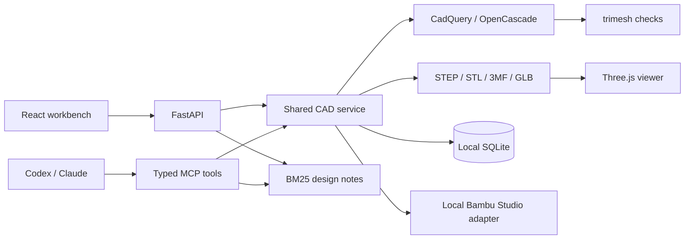

# Architecture

## Ownership

`models.py` validates explicit design inputs before geometry is generated. `cad.py` owns trusted
templates and exports. `service.py` serializes CAD generation, records immutable input snapshots,
hashes artifacts and saves history. API and MCP call this same service.

The retrieval corpus is evidence, not executable instructions. The web parser only recognizes
named dimensions, units, material and known part families. An MCP client may reason over a larger
request but still submits a bounded `DesignSpec`.

## Units and physical meaning

CAD, STL, 3MF and reports use millimeters. glTF/GLB uses meters; the engineering viewer converts
back to millimeters. Enclosure clearance is per side. Adapter clearance is radial and increases
the bore diameter by twice the requested value.

Parts are laid out apart for export. The envelope check is per component; a separate warning
records when the combined layout needs rearranging or separate plates. Collision checking is
performed in this exported layout, not in an assembled functional simulation.

## Validation stages

1. Parameters: finite, bounded values and template-specific dimensional relationships.
2. CAD: valid exact solids, positive volumes and intersection checks.
3. Mesh: watertightness, orientation, connected shells and dimensions.
4. Manufacturing rules: template wall versus nozzle and per-part printer envelope.
5. Slicer: exact preset resolution, actual process execution and embedded G-code validation.
6. Physical result: not implemented; requires a measured test print and recorded observations.

Geometry success is stored as `geometry_validated`. Slicer state is separate and initially
`not_run`. Neither state means a physical print has been completed.

## Public and private editions

This repository is the public engine, fixtures, workbench, tests and documentation. The future
private edition will depend on or sync general improvements from this core and add local
configuration, personal geometry, PiSentinel integration and a separately approved printer action
layer. The private edition is a separate repository, not a public repository branch.
